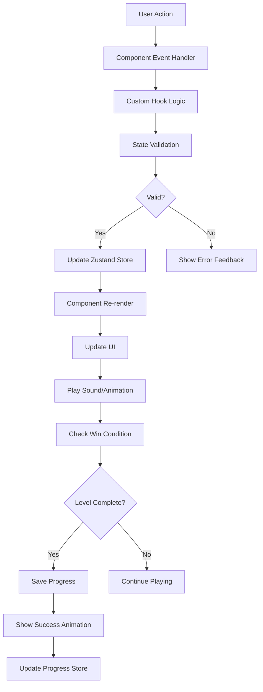
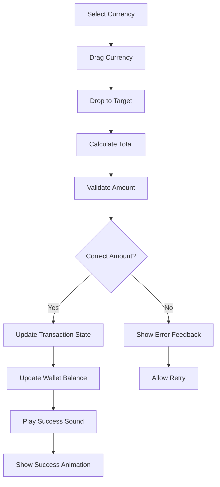
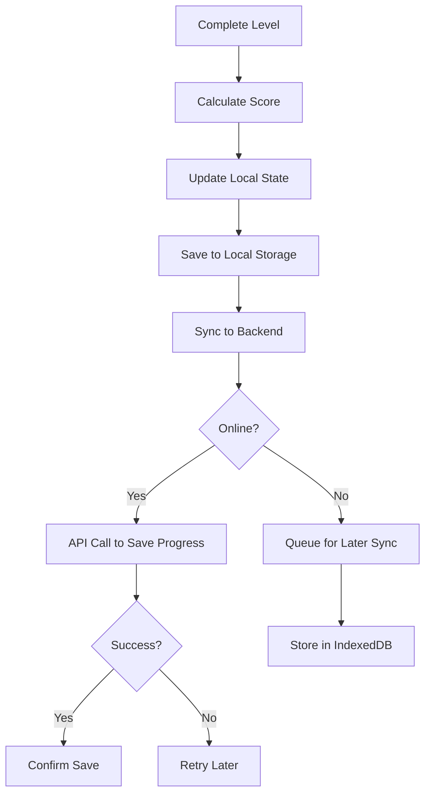
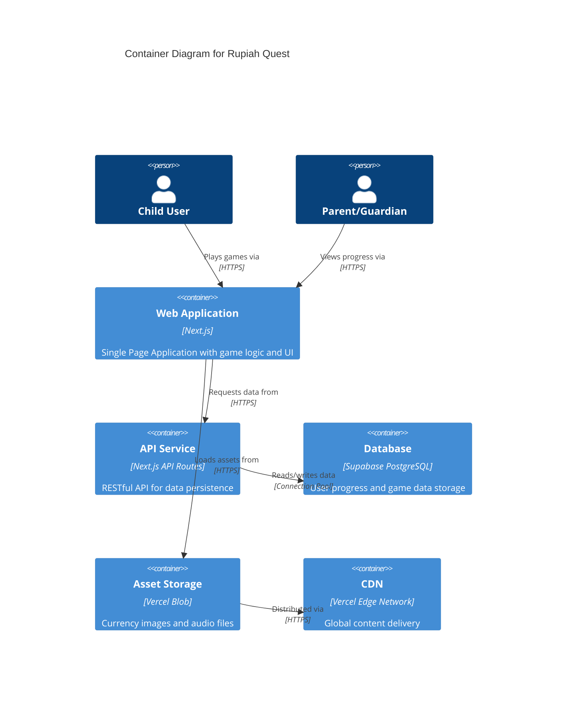
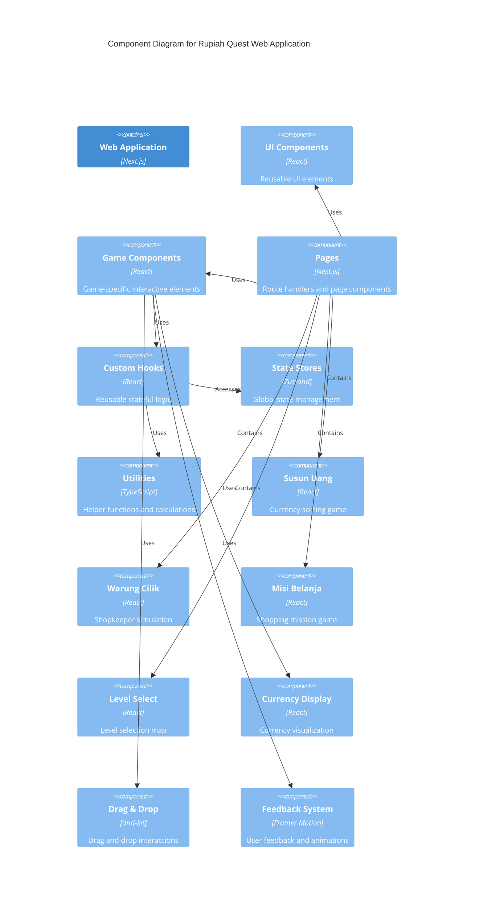

# Rupiah Quest - Comprehensive Application Architecture

## Table of Contents
1. [Executive Summary](#executive-summary)
2. [Requirements Analysis](#requirements-analysis)
   - [Functional Requirements](#functional-requirements)
   - [Non-Functional Requirements](#non-functional-requirements)
   - [User Personas](#user-personas)
   - [Business Logic Rules](#business-logic-rules)
3. [Technical Constraints & API Specifications](#technical-constraints--api-specifications)
4. [Documentation Analysis](#documentation-analysis)
5. [System Architecture](#system-architecture)
   - [High-Level Architecture](#high-level-architecture)
   - [Component Breakdown](#component-breakdown)
   - [Technology Stack](#technology-stack)
   - [Data Flow](#data-flow)
6. [Security Model](#security-model)
7. [Non-Functional Strategy](#non-functional-strategy)
8. [C4 Model Diagrams](#c4-model-diagrams)
9. [Implementation Roadmap](#implementation-roadmap)
10. [Conclusion](#conclusion)

## Executive Summary

Rupiah Quest is an educational web application designed to help Indonesian children (ages 6-12) master financial literacy through engaging, gamified simulations of real-world money handling using the Indonesian Rupiah. The application will be built as a browser-based interactive game with culturally relevant scenarios, focusing on the unique visual challenges of Indonesian currency.

## Requirements Analysis

### Functional Requirements

#### Core Game Features
1. **Susun Uang (Sort the Salary)**
   - Sorting challenges for currency recognition
   - Visual differentiation between similar banknotes and coins
   - Progressive difficulty levels

2. **Warung Cilik (Shopkeeper Simulation)**
   - Cashier interface simulation
   - Change calculation functionality
   - Drag-and-drop money handling
   - Transaction logic teaching subtraction

3. **Misi Belanja (Shopping Mission)**
   - Budgeting game mechanics
   - Shopping cart with item selection
   - Wallet balance tracking
   - Needs vs. wants prioritization
   - Overspending prevention

4. **Game Progression System**
   - Level selection map
   - Difficulty progression (Early Explorer vs. Junior Saver)
   - Score tracking and achievements
   - Visual progress indicators

5. **Interactive Elements**
   - Drag-and-drop mechanics for money handling
   - Touch-friendly interface for mobile devices
   - Sound effects ("cha-ching", success chimes)
   - Success animations (confetti/stars)
   - Visual feedback for correct/incorrect actions

#### Advanced Features
1. **Discount Logic**
   - "Buy 2 get discount" calculations
   - Percentage and fixed amount discounts
   - Multiple discount combinations

2. **Needs vs. Wants System**
   - Mandatory "Needs" items in shopping lists
   - Optional "Wants" items with budget constraints
   - Decision-making trade-offs

3. **Educational Feedback**
   - Real-time guidance for incorrect actions
   - Explanations for financial concepts
   - Progressive hints system

### Non-Functional Requirements

#### Performance Requirements
1. **Response Time**
   - Initial load time: < 3 seconds
   - Interaction response: < 200ms
   - Animation frame rate: 60fps

2. **Mobile Optimization**
   - Touch-friendly interface (minimum 44x44px tap targets)
   - Responsive design for various screen sizes
   - Optimized for mobile network conditions

3. **Browser Compatibility**
   - Support for modern browsers (Chrome, Firefox, Safari, Edge)
   - Progressive enhancement for older browsers

#### Accessibility Requirements
1. **WCAG 2.1 AA Compliance**
   - Semantic HTML structure
   - Keyboard navigation support
   - Screen reader compatibility
   - Sufficient color contrast (4.5:1 for normal text)
   - Alternative text for images
   - ARIA attributes for complex components

2. **Age-Appropriate Design**
   - Large, clear visual elements for young children
   - Simple, intuitive navigation
   - Minimal text reliance for early readers

#### Usability Requirements
1. **Intuitive Interface**
   - Clear visual hierarchy
   - Consistent interaction patterns
   - Minimal learning curve

2. **Engagement**
   - Gamification elements
   - Immediate feedback
   - Progressive difficulty

#### Reliability Requirements
1. **Error Handling**
   - Graceful degradation for non-critical failures
   - User-friendly error messages
   - Input validation with clear feedback

2. **Data Persistence**
   - Game progress saving
   - Offline capability for core features

### User Personas

#### Primary Personas

1. **Early Explorer (Ages 6-8)**
   - **Characteristics**: Just learning to recognize numbers and colors
   - **Needs**: Visual cues, simple interactions, immediate feedback
   - **Pain Points**: 
     - Confusing similar-looking banknotes (e.g., Rp 2.000 vs Rp 20.000)
     - Struggling with "change" concept (subtraction)
   - **Goals**: Confidently identify money and buy treats at a real warung without help
   - **Context**: Playing on parent's smartphone via browser during short free-time sessions

2. **Junior Saver (Ages 9-12)**
   - **Characteristics**: Ready for arithmetic, budgeting, and trade-off decisions
   - **Needs**: Complex challenges, strategic thinking, real-world applications
   - **Pain Points**: 
     - Understanding value vs. price
     - Making budgeting decisions
     - Calculating discounts and change
   - **Goals**: Develop practical financial literacy skills for real-world shopping
   - **Context**: Independent play sessions with increasing duration

#### Secondary Personas

3. **Parent/Guardian**
   - **Characteristics**: Concerned about child's financial education
   - **Needs**: Progress tracking, educational value, safe environment
   - **Pain Points**: Finding quality educational content, monitoring progress
   - **Goals**: Ensure child develops practical financial skills

### Business Logic Rules

#### Currency Handling Rules
1. **Indonesian Rupiah Denominations**
   - Coins: Rp 100, Rp 200, Rp 500, Rp 1.000
   - Banknotes: Rp 1.000, Rp 2.000, Rp 5.000, Rp 10.000, Rp 20.000, Rp 50.000, Rp 100.000
   - Visual distinction requirements for similar denominations

2. **Transaction Rules**
   - Change calculation must be exact
   - Multiple payment methods allowed
   - Minimum and maximum transaction amounts per level

#### Game Progression Rules
1. **Level Unlocking**
   - Sequential progression within difficulty tiers
   - Prerequisite completion for advanced features
   - Skill-based assessment for level recommendations

2. **Scoring System**
   - Points for correct actions
   - Time bonuses for quick completion
   - Accuracy multipliers
   - Streak bonuses for consecutive correct answers

#### Educational Rules
1. **Age-Appropriate Content**
   - Early Explorer: Simple recognition, basic counting
   - Junior Saver: Complex calculations, budgeting, discounts
   - Progressive complexity based on demonstrated skill

2. **Learning Objectives**
   - Currency recognition and differentiation
   - Basic arithmetic operations (addition, subtraction)
   - Transaction logic and change calculation
   - Budgeting and prioritization
   - Understanding value and making trade-offs

## Technical Constraints & API Specifications

### Existing Technical Stack
1. **Framework & Runtime**
   - Next.js (React) as application framework
   - TypeScript / Node.js for language/runtime
   - npm as package manager

2. **Frontend Technologies**
   - React for UI components
   - Tailwind CSS for styling
   - Framer Motion for animations
   - dnd-kit for drag-and-drop interactions

3. **State Management**
   - Zustand for lightweight state management
   - Global state for Wallet balance, Score, and Shopping Cart

4. **Assets & Media**
   - Howler.js for sound effects
   - Optimized SVG graphics for currency

5. **Testing & Quality**
   - Jest for unit logic testing
   - Playwright for E2E game flow testing
   - ESLint and Prettier for code quality

6. **Deployment & Infrastructure**
   - Vercel for hosting
   - GitHub Actions for CI/CD

### Technical Standards & Constraints
1. **API Standards**
   - RESTful design principles
   - Consistent naming conventions (lowercase, hyphenated)
   - API versioning strategy
   - Plural nouns for resource endpoints
   - Limited nesting depth (2-3 levels maximum)
   - Appropriate HTTP status codes
   - Rate limiting headers

2. **Frontend Standards**
   - Single responsibility principle for components
   - Reusability and composability
   - Clear interfaces with documented props
   - Component encapsulation
   - Consistent naming conventions
   - Local state management with lifting when needed
   - Minimal props with composition for complexity

3. **Responsive Design Standards**
   - Mobile-first development approach
   - Standard breakpoints across application
   - Fluid layouts with percentage-based widths
   - Relative units (rem/em) over fixed pixels
   - Cross-device testing requirements
   - Touch-friendly design (44x44px minimum)
   - Mobile performance optimization
   - Readable typography across breakpoints
   - Content priority for smaller screens

4. **Error Handling Standards**
   - User-friendly error messages
   - Fail fast and explicit validation
   - Specific exception types
   - Centralized error handling
   - Graceful degradation
   - Retry strategies for transient failures
   - Resource cleanup in error scenarios

5. **Validation Standards**
   - Server-side validation as security baseline
   - Client-side validation for UX
   - Early validation and rejection
   - Specific, field-specific error messages
   - Allowlists over blocklists
   - Type and format validation
   - Input sanitization
   - Business rule validation
   - Consistent validation across entry points

6. **Accessibility Standards**
   - Semantic HTML elements
   - Keyboard navigation with focus indicators
   - Color contrast compliance (4.5:1)
   - Alternative text for images
   - Screen reader testing
   - ARIA attributes when needed
   - Logical heading structure
   - Focus management in dynamic content

7. **Testing Standards**
   - Minimal tests during development
   - Focus on core user flows
   - Defer edge case testing
   - Test behavior, not implementation
   - Clear test names
   - Mock external dependencies
   - Fast test execution

## Documentation Analysis

### Identified Ambiguities
1. **Data Persistence Strategy**
   - No clear specification for saving game progress
   - Unclear if local storage or backend persistence is required
   - No mention of user accounts or authentication

2. **Multiplayer Features**
   - "Collaboration Features" mentioned but not detailed
   - Unclear if real-time collaboration is required
   - No specification for shared game states

3. **Offline Functionality**
   - No clear requirements for offline capability
   - Unclear which features should work without internet
   - No synchronization strategy mentioned

### Identified Gaps
1. **Backend Requirements**
   - No API specifications beyond frontend needs
   - No database schema or data models defined
   - No authentication or user management system specified

2. **Performance Metrics**
   - No specific performance benchmarks
   - No scalability requirements defined
   - No monitoring or analytics strategy mentioned

3. **Content Management**
   - No system for managing game content (levels, items, prices)
   - No strategy for updating currency assets
   - No content delivery optimization specified

### Identified Conflicts
1. **Technology Stack Completeness**
   - Frontend stack well-defined but backend minimal
   - Database and backend frameworks not specified
   - No clear integration strategy between frontend and backend

2. **Testing Strategy**
   - Emphasis on minimal testing during development
   - No quality gates or coverage requirements
   - Potential conflict with educational app reliability needs

## System Architecture

### High-Level Architecture

#### Architectural Style: Client-Centric Web Application with Progressive Enhancement

The Rupiah Quest application will follow a client-centric architecture pattern with the following characteristics:

1. **Single Page Application (SPA) with Server-Side Rendering (SSR)**
   - Next.js provides both client-side interactivity and server-side rendering
   - Optimized for initial load performance and SEO
   - Progressive enhancement for broader device support

2. **Component-Based Frontend Architecture**
   - Modular React components with clear separation of concerns
   - Reusable UI components across different game scenarios
   - State management分层设计 (local, component, global)

3. **Event-Driven Game Logic**
   - Game events trigger state changes and reactions
   - Decoupled game mechanics from UI components
   - Extensible for future game features

4. **Progressive Web App (PWA) Capabilities**
   - Offline functionality for core game features
   - App-like experience on mobile devices
   - Background sync for progress saving

#### Architectural Principles

1. **Mobile-First Design**
   - Optimized for touch interactions
   - Responsive layout adapting to screen sizes
   - Performance optimized for mobile networks

2. **Accessibility by Design**
   - WCAG 2.1 AA compliance from the ground up
   - Semantic HTML structure
   - Keyboard and screen reader support

3. **Performance-First Approach**
   - Optimized asset loading and caching
   - Minimal JavaScript bundle size
   - Efficient animation rendering

4. **Educational Effectiveness**
   - Age-appropriate complexity progression
   - Immediate feedback and reinforcement
   - Engaging gamification elements

### Component Breakdown

#### Frontend Component Architecture

```
src/
├── components/           # Reusable UI components
│   ├── ui/              # Basic UI elements
│   │   ├── Button/
│   │   ├── Card/
│   │   ├── Modal/
│   │   └── ...
│   ├── game/            # Game-specific components
│   │   ├── Currency/
│   │   │   ├── Banknote/
│   │   │   ├── Coin/
│   │   │   └── CurrencyDisplay/
│   │   ├── DragDrop/
│   │   │   ├── DragArea/
│   │   │   ├── DropZone/
│   │   │   └── DragProvider/
│   │   └── Feedback/
│   │       ├── SuccessAnimation/
│   │       ├── ErrorIndicator/
│   │       └── ScoreDisplay/
│   └── layout/          # Layout components
│       ├── Header/
│       ├── Navigation/
│       └── Footer/
├── pages/               # Next.js pages
│   ├── index.tsx        # Home/Landing
│   ├── susun-uang/      # Currency sorting game
│   ├── warung-cilik/    # Shopkeeper simulation
│   ├── misi-belanja/    # Shopping mission
│   └── level-select/    # Level selection map
├── hooks/               # Custom React hooks
│   ├── useGameState.ts
│   ├── useCurrency.ts
│   ├── useSound.ts
│   └── useAnimation.ts
├── stores/              # Zustand stores
│   ├── gameStore.ts
│   ├── walletStore.ts
│   ├── progressStore.ts
│   └── settingsStore.ts
├── utils/               # Utility functions
│   ├── currency.ts
│   ├── gameLogic.ts
│   ├── validation.ts
│   └── helpers.ts
├── types/               # TypeScript type definitions
│   ├── game.ts
│   ├── currency.ts
│   └── user.ts
└── assets/              # Static assets
    ├── images/
    │   ├── currency/    # SVG currency assets
    │   ├── items/       # Shop items
    │   └── ui/          # UI icons and elements
    └── sounds/          # Audio files
```

#### Component Responsibilities

1. **UI Components (`components/ui/`)**
   - Basic, reusable UI elements
   - Consistent styling and behavior
   - Accessibility features built-in
   - Examples: Button, Card, Modal, Input

2. **Game Components (`components/game/`)**
   - **Currency Components**: Handle display and interaction with money
     - `Banknote/`: Individual banknote representation
     - `Coin/`: Individual coin representation
     - `CurrencyDisplay/`: Grouped currency display
   - **DragDrop Components**: Handle drag-and-drop interactions
     - `DragArea/`: Container for draggable items
     - `DropZone/`: Target area for dropped items
     - `DragProvider/`: Context for drag-and-drop state
   - **Feedback Components**: Provide user feedback
     - `SuccessAnimation/`: Celebration animations
     - `ErrorIndicator/`: Error state visualization
     - `ScoreDisplay/`: Score and progress display

3. **Layout Components (`components/layout/`)**
   - Page structure and navigation
   - Responsive layout management
   - Consistent header/footer implementation

4. **Custom Hooks (`hooks/`)**
   - `useGameState`: Game state management and logic
   - `useCurrency`: Currency-related operations and calculations
   - `useSound`: Sound effect management
   - `useAnimation`: Animation control and timing

5. **State Management (`stores/`)**
   - `gameStore`: Current game state, level, scoring
   - `walletStore`: Wallet balance, transaction history
   - `progressStore`: User progress, achievements, unlocked levels
   - `settingsStore`: User preferences, audio settings

#### Backend Component Architecture (Minimal Implementation)

```
server/
├── api/                 # API routes
│   ├── progress/        # User progress endpoints
│   ├── scores/          # High scores and leaderboards
│   └── content/         # Game content management
├── models/              # Data models
│   ├── User.ts
│   ├── Progress.ts
│   └── Score.ts
├── services/            # Business logic
│   ├── progressService.ts
│   ├── scoreService.ts
│   └── contentService.ts
├── middleware/          # Express middleware
│   ├── auth.ts
│   ├── validation.ts
│   └── errorHandler.ts
└── utils/               # Server utilities
    ├── database.ts
    ├── cache.ts
    └── logger.ts
```

### Technology Stack

#### Frontend Stack (Confirmed)

1. **Framework & Runtime**
   - **Next.js 14+**: React framework with SSR/SSG capabilities
     - Justification: Provides optimal performance, SEO benefits, and excellent developer experience
     - Aligns with requirement for fast initial load times and mobile optimization

2. **Language & Type System**
   - **TypeScript**: Static typing for JavaScript
     - Justification: Improves code quality, enables better refactoring, and catches errors early
     - Essential for complex game logic and state management

3. **UI Framework & Styling**
   - **React 18+**: UI component library
     - Justification: Component-based architecture aligns with modular game design
     - Large ecosystem and community support
   - **Tailwind CSS**: Utility-first CSS framework
     - Justification: Rapid development, consistent design system, excellent mobile responsiveness
     - Aligns with responsive design requirements

4. **Animation & Interaction**
   - **Framer Motion**: Animation library for React
     - Justification: Declarative animations, optimized performance, gesture support
     - Essential for engaging game animations and transitions
   - **dnd-kit**: Drag and drop library
     - Justification: Modern, accessible, performant drag-and-drop
     - Critical for currency manipulation game mechanics

5. **State Management**
   - **Zustand**: Lightweight state management
     - Justification: Simple API, TypeScript support, minimal boilerplate
     - Ideal for game state, wallet management, and progress tracking

6. **Audio & Assets**
   - **Howler.js**: Audio library
     - Justification: Cross-browser compatibility, audio sprite support
     - Essential for sound effects and audio feedback
   - **Optimized SVG**: Vector graphics for currency
     - Justification: Scalable, small file size, crisp at all resolutions
     - Critical for clear currency representation

#### Backend Stack (Recommended)

1. **Framework & Runtime**
   - **Next.js API Routes**: Serverless API endpoints
     - Justification: Integrated with frontend, no additional infrastructure needed
     - Sufficient for minimal backend requirements

2. **Database**
   - **Supabase**: Backend-as-a-Service with PostgreSQL
     - Justification: Real-time capabilities, authentication, and easy integration
     - Provides user management, progress tracking, and data persistence

3. **File Storage**
   - **Vercel Blob**: File storage for assets
     - Justification: Integrated with hosting, CDN delivery
     - Optimal for currency assets and game content

#### Testing Stack (Confirmed)

1. **Unit Testing**
   - **Jest**: JavaScript testing framework
     - Justification: Excellent TypeScript support, mocking capabilities
     - Essential for game logic validation

2. **E2E Testing**
   - **Playwright**: End-to-end testing framework
     - Justification: Cross-browser testing, mobile device simulation
     - Critical for game flow validation

#### Deployment & DevOps Stack (Confirmed)

1. **Hosting**
   - **Vercel**: Next.js hosting platform
     - Justification: Optimized for Next.js, global CDN, automatic deployments
     - Aligns with performance and scalability requirements

2. **CI/CD**
   - **GitHub Actions**: Workflow automation
     - Justification: Integrated with code repository, flexible configuration
     - Essential for automated testing and deployment

### Data Flow

#### Game State Flow



#### Currency Transaction Flow



#### Progress Persistence Flow



## Security Model

### Authentication & Authorization

#### Minimal Authentication Strategy
Given the educational nature and target audience (children), we'll implement a minimal authentication approach:

1. **Anonymous User Sessions**
   - Device-based session identification
   - No personal information required
   - Local progress storage with optional cloud sync

2. **Optional Parent Accounts**
   - Simple email/password for progress tracking
   - Child profiles linked to parent account
   - Minimal data collection (progress, scores)

3. **Privacy-First Approach**
   - No personal data collection for children
   - Compliance with COPPA and similar regulations
   - Transparent data usage policies

### Data Protection

1. **Client-Side Data**
   - Sensitive game state validation on server
   - Encrypted local storage for progress
   - Secure communication protocols (HTTPS)

2. **Server-Side Data**
   - Input sanitization and validation
   - Rate limiting on API endpoints
   - Secure database access patterns

3. **Content Security**
   - CSP headers to prevent XSS
   - Asset integrity verification
   - Secure third-party resource loading

### Security Implementation

```typescript
// Example of secure API route with validation
import { z } from 'zod';
import { NextApiRequest, NextApiResponse } from 'next';

const progressSchema = z.object({
  level: z.number().min(1).max(100),
  score: z.number().min(0),
  stars: z.number().min(0).max(3),
  sessionId: z.string().uuid(),
});

export default async function handler(
  req: NextApiRequest,
  res: NextApiResponse
) {
  if (req.method !== 'POST') {
    return res.status(405).json({ error: 'Method not allowed' });
  }

  try {
    const validatedData = progressSchema.parse(req.body);
    // Process validated data
    res.status(200).json({ success: true });
  } catch (error) {
    res.status(400).json({ error: 'Invalid data' });
  }
}
```

## Non-Functional Strategy

### Performance Strategy

1. **Initial Load Optimization**
   - Code splitting by routes and components
   - Critical CSS inlining for above-the-fold content
   - Preloading of essential assets
   - Progressive image loading

2. **Runtime Performance**
   - Efficient React rendering with memoization
   - Optimized animation frames with requestAnimationFrame
   - Debounced user interactions
   - Memory leak prevention

3. **Asset Optimization**
   - SVG optimization for currency assets
   - Audio compression and sprites
   - Image optimization with next/image
   - Font subsetting for custom typography

### Scalability Strategy

1. **Frontend Scalability**
   - Component-based architecture for maintainability
   - State management separation for complexity management
   - Lazy loading for non-critical features
   - Service workers for offline capability

2. **Backend Scalability**
   - Serverless functions for automatic scaling
   - Database connection pooling
   - Caching strategies for frequently accessed data
   - CDN for global asset delivery

3. **Content Scalability**
   - Dynamic content loading system
   - Asset versioning and cache invalidation
   - Modular game content structure
   - Easy content update mechanisms

### Fault Tolerance Strategy

1. **Error Boundaries**
   - React error boundaries for graceful failure
   - Fallback UI for component failures
   - Error reporting for debugging
   - User-friendly error messages

2. **Network Resilience**
   - Exponential backoff for API retries
   - Offline mode with local storage
   - Sync strategies for reconnection
   - Progressive enhancement for varying network conditions

3. **Data Integrity**
   - Client-side validation with server verification
   - Transaction-like operations for critical data
   - Backup strategies for user progress
   - Recovery mechanisms for corrupted data

## C4 Model Diagrams

### System Context Diagram

```mermaid
C4Context
    title System Context Diagram for Rupiah Quest
    
    Person(user, "Child User (6-12 years)", "Plays educational financial literacy games")
    Person(parent, "Parent/Guardian", "Monitors child's progress and manages settings")
    
    System(rupiah_quest, "Rupiah Quest", "Educational web application for financial literacy")
    
    System_Ext(browser, "Web Browser", "Chrome, Firefox, Safari, Edge")
    System_Ext(app_store, "App Stores", "Progressive Web App installation")
    System_extern(analytics, "Analytics Service", "Usage tracking and insights")
    
    Rel(user, rupiah_quest, "Plays games via", "HTTPS")
    Rel(parent, rupiah_quest, "Monitors progress via", "HTTPS")
    Rel(rupiah_quest, browser, "Runs in", "HTML5, CSS3, JavaScript")
    Rel(rupiah_quest, app_store, "Available as", "PWA")
    Rel(rupiah_quest, analytics, "Sends usage data to", "HTTPS")
```

### Container Diagram



### Component Diagram



## Implementation Roadmap

### Phase 1: Foundation (Weeks 1-2)
1. **Project Setup**
   - Initialize Next.js project with TypeScript
   - Configure Tailwind CSS and development environment
   - Set up testing framework (Jest, Playwright)
   - Establish CI/CD pipeline with GitHub Actions

2. **Asset Preparation**
   - Create optimized SVG assets for all Rupiah denominations
   - Prepare sound effects and audio sprites
   - Establish asset management system
   - Implement loading and caching strategies

### Phase 2: Core Game Mechanics (Weeks 3-5)
1. **Susun Uang Implementation**
   - Build currency recognition components
   - Implement drag-and-drop functionality
   - Create sorting game logic and validation
   - Add visual and audio feedback

2. **State Management**
   - Implement Zustand stores for game state
   - Create wallet and scoring systems
   - Develop progress tracking mechanism
   - Add local persistence

### Phase 3: Advanced Features (Weeks 6-8)
1. **Warung Cilik Development**
   - Build cashier interface
   - Implement change calculation logic
   - Add transaction simulation
   - Create progressive difficulty levels

2. **Misi Belanja Implementation**
   - Develop shopping interface
   - Implement budgeting mechanics
   - Add needs vs. wants system
   - Create discount logic

### Phase 4: Polish and Enhancement (Weeks 9-10)
1. **Game Loop and Feedback**
   - Integrate success animations
   - Implement comprehensive sound system
   - Add level progression map
   - Create achievement system

2. **Testing and Optimization**
   - Comprehensive E2E testing
   - Performance optimization
   - Accessibility audit and improvements
   - Cross-device compatibility testing

### Phase 5: Deployment and Monitoring (Weeks 11-12)
1. **Production Deployment**
   - Configure production environment
   - Set up monitoring and analytics
   - Implement error tracking
   - Prepare launch documentation

## Conclusion

The Rupiah Quest application architecture is designed to provide an engaging, educational experience for Indonesian children learning financial literacy. The architecture prioritizes:

1. **Educational Effectiveness**: Through carefully designed game mechanics that progress from simple currency recognition to complex budgeting decisions.

2. **Technical Excellence**: By implementing modern web technologies with proven patterns for performance, accessibility, and maintainability.

3. **User Experience**: Through a mobile-first, responsive design that works seamlessly across devices and provides immediate feedback.

4. **Scalability**: By implementing a component-based architecture that can grow with new features and content without requiring major refactoring.

5. **Cultural Relevance**: By focusing specifically on Indonesian currency and real-world scenarios like warung shopping experiences.

The architecture balances simplicity for rapid development with robustness for long-term maintenance, ensuring that the application can evolve with the needs of its young users while maintaining high standards of performance and accessibility.